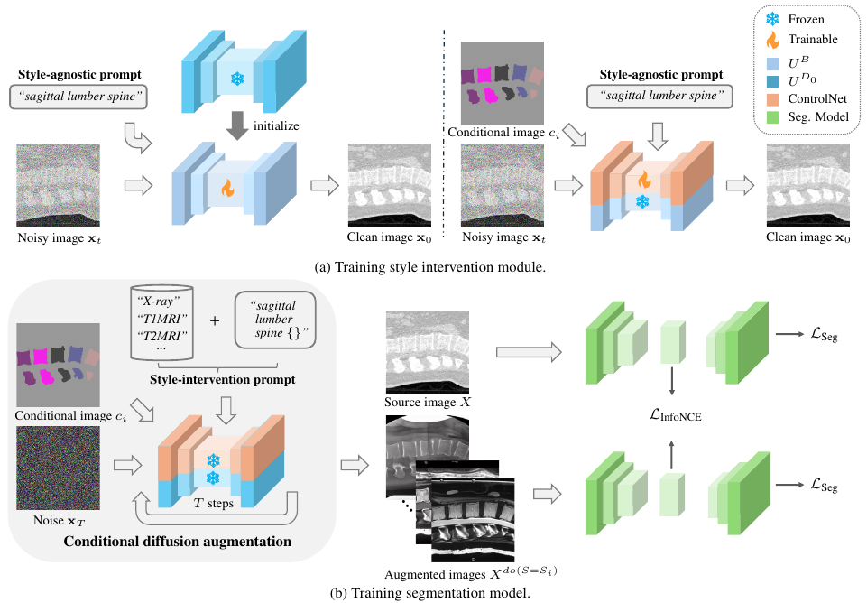

# Generalizable Single-Source Cross-modality Medical Image Segmentation via Invariant Causal Mechanisms

## Abstract
Single-source domain generalization (SDG) aims to learn a model from a single source domain that can generalize well on unseen target domains. This is an important task in computer vision, particularly relevant to medical imaging where domain shifts are common. In this work, we consider a challenging yet practical setting: SDG for cross-modality medical image segmentation. We combine causality-inspired theoretical insights on learning domain-invariant representations with recent advancements in diffusion-based augmentation to improve generalization across diverse imaging modalities. Guided by the ``intervention-augmentation equivariant'' principle, we use controlled diffusion models (DMs) to simulate diverse imaging styles while preserving the content, leveraging rich generative priors in large-scale pretrained DMs to comprehensively perturb the multidimensional style variable. Extensive experiments on challenging cross-modality segmentation tasks demonstrate that our approach consistently outperforms state-of-the-art SDG methods across three distinct anatomies and imaging modalities.



## Installation

Ensure you have Python installed and the required dependencies. You can install the dependencies using:

```bash
conda env create -f environment.yml
```

## Running the Model

## Generating style-intervened images using diffusion augmentation
This repository includes a diffusion augmentation module that follows the implementation from [DGInStyle](https://github.com/prs-eth/DGInStyle), which is provided as a submodule. The base diffusion model is from [Nihirc/Prompt2MedImage](https://huggingface.co/Nihirc/Prompt2MedImage?text=A+sagittal+slice+of+lumbar+spine+CT+scan). 

## Dataset structure
We train on 2D slices extracted from 3D volumes. We provide an example of using the VerSe dataset as the source domain and MRSPineSegV as the target domain. Since the inference for the diffusion model is slow, we precompute the style-intervened images instead of computing them on-the-fly during training, at the cost of style intervention diversity. For simplicity, we consider only one set of style-intervened images, while the style sets can be arbitrary. 

There should be two folders of source images, VerSe and VerSe_mri (i.e., the style-intervened images from the diffusion-based augmentation). 

The folder structure of VerSe is as follows:
```
VerSe
├── train
│   ├── images
│   │   ├── volume0_slice_0.png
│   │   ├── volume0_slice_1.png
│   │   ├── volume0_slice_2.png
│   ├── labels
│   │   ├── volume0_slice_0_labelTrainIds.png
│   │   ├── volume0_slice_1_labelTrainIds.png
│   │   ├── volume0_slice_2_labelTrainIds.png
│   ...
├── val
├── test
```
```
VerSe_mri
├── train
│   ├── images
│   │   ├── volume0_slice_0.png
│   │   ├── volume0_slice_1.png
│   │   ├── volume0_slice_2.png
│   ├── labels
│   │   ├── volume0_slice_0_labelTrainIds.png
│   │   ├── volume0_slice_1_labelTrainIds.png
│   │   ├── volume0_slice_2_labelTrainIds.png
│   ...
├── val
├── test
```
If you want to filter the images with no foreground for training, you should have an additional folder:
```
├── train-filtered
│   ├── images
│   │   ├── volume0_slice_55.png
│   ├── labels
│   │   ├── volume0_slice_55_labelTrainIds.png
│   ...
```

### Training
To train the model using the **VERSE Style Contrast** method on the **Lumbar Spine** dataset, run:

```bash
python main.py method=verse_style_contrast dataset=lumbarspine experiment=verse
```
If you want to train on filtered data (i.e., slices with foreground), run:

```bash
python main.py method=verse_style_contrast dataset=lumbarspine experiment=verse +filter=1
```

### Testing
To test the trained model, specify the checkpoint file (`path/to/model`) and use the following command:

```bash
python main.py method=verse_style_contrast dataset=lumbarspine experiment=verse +ckpt_in=path/to/model ++run_typ=test
```

## Configuration
The script uses Hydra for configuration management. You can customize the training and testing settings by modifying the respective experiment configurations.

## Citation
```
@inproceedings{chen2024generalizable,
  title={Generalizable Single-Source Cross-modality Medical Image Segmentation via Invariant Causal Mechanisms},
  author={Chen, Boqi and Zhu, Yuanzhi and Ao, Yunke and Caprara, Sebastiano and Sutter, Reto and R{"a}tsch, Gunnar and Konukoglu, Ender and Susmelj, Anna},
  booktitle = {IEEE/CVF Winter Conference on Applications of Computer Vision},
  year={2025}
}
```

## License
This project is licensed under the MIT License. See the `LICENSE` file for details.

## Acknowledgements
The diffusion augmentation module in this repository is based on [DGInStyle](https://github.com/prs-eth/DGInStyle). 

```
@inproceedings{jia2024dginstyle,
  title     = {DGInStyle: Domain-Generalizable Semantic Segmentation with Image Diffusion Models and Stylized Semantic Control}, 
  author    = {Yuru Jia and Lukas Hoyer and Shengyu Huang and Tianfu Wang and Luc Van Gool and Konrad Schindler and Anton Obukhov},
  booktitle = {European Conference on Computer Vision},
  year      = {2024},
}
```

If you use the VerSe and MRSpineSegV dataset, please consider citing:

```
@article{sekuboyina2020labeling,
  title={Labeling vertebrae with two-dimensional reformations of multidetector CT images: an adversarial approach for incorporating prior knowledge of spine anatomy},
  author={Sekuboyina, Anjany and Rempfler, Markus and Valentinitsch, Alexander and Menze, Bjoern H and Kirschke, Jan S},
  journal={Radiology: Artificial Intelligence},
  volume={2},
  number={2},
  pages={e190074},
  year={2020},
  publisher={Radiological Society of North America}
}
```

```
@article{pang2020spineparsenet,
  title={SpineParseNet: spine parsing for volumetric MR image by a two-stage segmentation framework with semantic image representation},
  author={Pang, Shumao and Pang, Chunlan and Zhao, Lei and Chen, Yangfan and Su, Zhihai and Zhou, Yujia and Huang, Meiyan and Yang, Wei and Lu, Hai and Feng, Qianjin},
  journal={IEEE Transactions on Medical Imaging},
  volume={40},
  number={1},
  pages={262--273},
  year={2020},
  publisher={IEEE}
}
```
